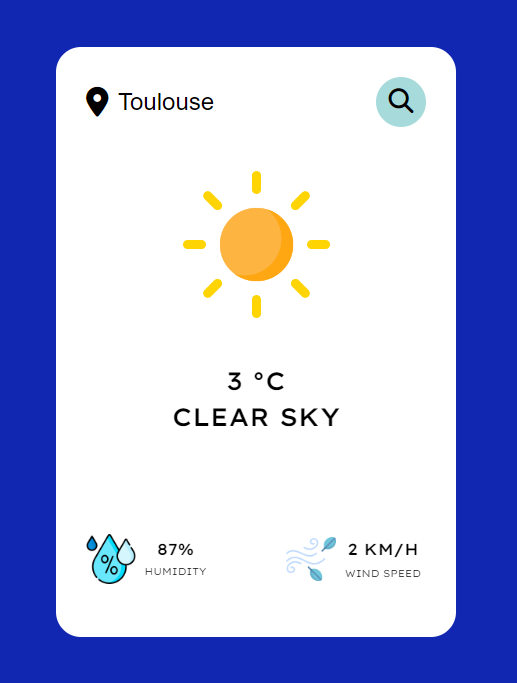

# WEATHER_APP

A simple and elegant weather app made with JavaScript, HTML, and CSS. It provides real-time weather updates for any location worldwide.

## Technologies Used
- **JavaScript**: For dynamic behavior and API integration.
- **HTML**: For structuring the application.
- **CSS**: For styling and animations.

## Screenshots




## Features
- **Real-time weather information**: Get the current temperature, weather conditions, and more.
- **Dynamic UI**: Smooth animations and transitions for an engaging user experience.
- **Responsive Design**: Works seamlessly on desktop and mobile devices.
- **Search Functionality**: Easily find weather updates by city name.

## API
This app uses the [OpenWeatherMap API](https://openweathermap.org/) to fetch real-time weather data.

## Installation
To run the project locally, follow these steps:

1. Clone the repository:
   ```bash
   git clone https://github.com/Jarod-G/WEATHER_APP.git
   ```

2. Navigate to the project folder:
   ```bash
   cd weather_app
   ```

3. Open `index.html` in your browser:
   ```bash
   open index.html
   ```

## Important Note

To use this app, you will need an API key from OpenWeatherMap. After obtaining your free API key:

Open the project files.

Locate the part of the code where the API key is required (const APIKey = 'YOUR_API_KEY'; index.js - line 10). 

Replace 'YOUR_API_KEY' with your actual API key.

Without a valid API key, the app will not fetch real-time weather data.

## Usage
- Enter the name of a city in the search bar.
- Press the search button to get the latest weather details.

## Inspiration

This project is inspired by [AsmrProg](www.youtube.com/watch?v=iILFBGm_I9M) and serves as a learning exercise to explore and improve skills in JavaScript, HTML, and CSS.